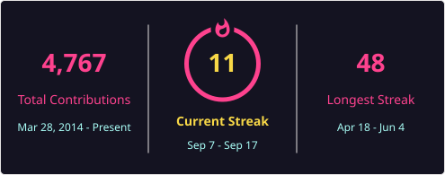

<div align="center">
  
</div>


<h1 align="center">
  Hi there! 👋 I'm Fabricio Cavalcante
</h1>

<h3 align="center">
  🚀 Software Engineer @ iFood | Founder @ VestiAI & Git Quest | AI Specialist | 🇧🇷 Brazil
</h3>

<p align="center">
  <i>"AI won't replace developers, but it will give superpowers to those who know how to use it."</i>
</p>

<p align="center">
  
  <a href="https://github.com/fcsouza?tab=followers">
    
  </a>
</p>

<br>

## 👨‍💻 About Me

```typescript
const fabricio = {
    location: "Rio de Janeiro, Brazil 🇧🇷",
    currentRoles: [
        "Software Engineer @ iFood",
        "Founder @ VestiAI & Git Quest"
    ],
    experience: "4+ years in high-scale systems",
    specialization: "AI & Software Architecture",
    education: [
        "MBA in AI - Full Cycle (2025-2026)",
        "Postgrad in AI - FIAP (2024-2025)",
        "Software Architecture Bootcamp - IGTI"
    ],
    companies: ["iFood", "Zoop", "BTG Pactual", "TOTVS"],
    focus: "Building scalable systems + AI-powered solutions",
    mission: "Transforming AI hype into tangible tools and real solutions",
    funFact: "When not coding, I'm conquering worlds in RPG and Strategy Games 🧙‍♂️"
};
```

<br>

## 🎯 What I'm Up To

- 💼 **Software Engineer @ iFood**: Building the future of payments with high-scale systems
- 🛍️ **Founder @ VestiAI & Git Quest**: Turning AI into products — virtual models for fashion brands and RPG adventures from your GitHub history
- 🎓 Completed **MBA in AI** at Full Cycle (2025-2026) + **AI Specialization** at FIAP (2024-2025)
- 🌱 Deep diving into **LangGraph, LangChain, RAG, AI SDK, Mastra SDK and AI Technologies**
- 💬 Ask me about **AI Implementation, Software Architecture, High-Scale Systems, and Startup MVPs**
- 🌐 Check out my work: [PulsoLab](https://pulsolab.com.br) | [VestiAI](https://vestiai.com.br) | [Git Quest](https://gitquest.dev) | [Darwin](https://darwin.ia.br)

<br>

## 🤝 Connect With Me

<p align="center">
  <a href="https://linkedin.com/in/fabricio-souza-ia" target="_blank">
    
  </a>
  <a href="mailto:fabricio.souza@pulsolab.com.br">
    
  </a>
</p>

<br>

## 🛠️ Tech Stack

### 🤖 AI & Agents
<p align="left">
  
  
  
  
  
</p>

### 💻 Languages
<p align="left">
  
  
  
  
</p>

### 🚀 Runtime & Frameworks
<p align="left">
  
  
  
  
  
</p>

### 🗄️ Data & Auth
<p align="left">
  
  
  
  
  
</p>

### ☁️ Cloud & Infra
<p align="left">
  
  
  
  
  
  
</p>

### 📡 Observability & Tools
<p align="left">
  
  
  
  
</p>

<br>

## 🚀 My Products

<div align="center">
  <a href="https://gitquest.dev">
    
  </a>
  <a href="https://vestiai.com.br">
    
  </a>
</div>

<p align="center">
  <b><a href="https://gitquest.dev">Git Quest</a></b>: a free RPG where every commit fuels your adventure
  &nbsp;·&nbsp;
  <b><a href="https://vestiai.com.br">VestiAI</a></b>: AI virtual models for fashion brands
</p>

<br>

## 🔥 Featured Projects

<p align="center">
  <a href="https://github.com/vttforge/vttforge"></a>
  <a href="https://github.com/fcsouza/agent-skills"></a>
</p>
<p align="center">
  <a href="https://github.com/fcsouza/psi-pra-todos"></a>
  <a href="https://github.com/fcsouza/claude-impact-rj26"></a>
</p>
<p align="center">
  <a href="https://github.com/fcsouza/pdf-character-sheet"></a>
  <a href="https://github.com/fcsouza/fome-zero"></a>
</p>

<br>

## 📊 GitHub Statistics

<div align="center">
  
  
</div>

<br>

<div align="center">
  
</div>

<br>

## 🏆 GitHub Trophies

<div align="center">
  
</div>

<br>

## 🐍 Contribution Snake

<div align="center">
  <picture>
    <source media="(prefers-color-scheme: dark)" srcset="./profile/snake-dark.svg" />
    <source media="(prefers-color-scheme: light)" srcset="./profile/snake.svg" />
    
  </picture>
</div>

<br>

---

<div align="center">
  <p>⭐️ From <a href="https://github.com/fcsouza">fcsouza</a> | Made with ❤️☕🤖</p>
  <p>
    <i>Open to new connections and collaborations!</i>
  </p>
</div>
